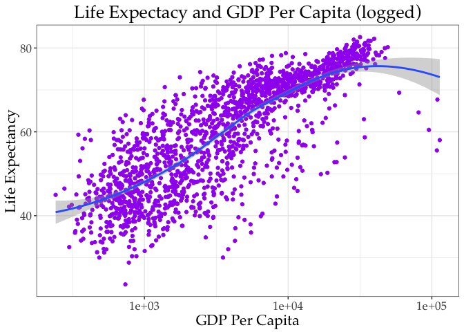

[GitHub](https://github.com/kho777/data-visualization/tree/master/workshops/ggplot2)

[Sample Program](https://raw.githubusercontent.com/kho777/data-visualization/master/workshops/ggplot2/ggplot2_1.R)

To start learning ggplot2, build a chart incrementally.  Let's begin by reviewing the basic RGraphics.  In this illustration, the Gapminder package is used.  It comes with six variables including country, continent, year, life expectancy, population and GDP per capita. 

Let's install the package, load the data and examine the dataset:

```r
install.packages("gapminder", repos = "https://cran.r-project.org")
library(gapminder)
summary(gapminder) # Summary of Gapminder dataset
str(gapminder) # Structure of dataset

gm=gapminder
head(gm)
summary(gm)
```


RGraphics come with simple plotting functions such as hist() and plot():

```r
# Plot one variable 
hist(gm$lifeExp) # Histogram of variable lifeExp (Life expectancy)
```

<!-- -->

The plot() function can do multiple variables:


```r
# Plot two variables with logged version of x
plot(lifeExp ~ gdpPercap, gm, subset = year == 2007, log = "x", pch=16)
```

<!-- -->

```r
# Plot two variables with selected country
plot(lifeExp ~ year, gm, subset = country == "Cambodia", type = "p")
```

<!-- -->

```r
# Try different plot types 
plot(lifeExp ~ year, gm, subset = country == "Cambodia", type = "l")
```

<!-- -->

```r
# Different symbols
plot(lifeExp ~ year, gm, subset = country == "Cambodia", type = "b", pch=18) 
```

<!-- -->

```r
# Add labels to axes
plot(lifeExp ~ year, gm, subset = country == "Cambodia", type = "b", pch=18, xlab="Year", ylab="Life Expectancy") 
```

<!-- -->

```r
# Specify font
plot(lifeExp ~ year, gm, subset = country == "Cambodia", type = "b", pch=18, xlab="Year", ylab="Life Expectancy",family="Palatino") 
```

<!-- -->

With ggplot2, we can apply the Grammer of Graphics methods and modify the chart with more finetuning and detail attention:

Let's install the package, load it and try it step by step:


```r
## install.packages("ggplot2", repos ="https://cran.r-project.org")
## library(ggplot2)
```


```r
# More layered plots using ggplot2

p <- ggplot2::ggplot(data = gm) 
```

Why there is no chart?

Add layer?


How about now?

```r
library(ggplot2)
p <- ggplot(data = gm,
            mapping = aes(x = gdpPercap,
                          y = lifeExp))  # Shows nothing. Why?
p + geom_point()
```

<!-- -->

First, we need to start the data component, then add the aesthetic mapping defining the basics (i.e. variables), followed by the geometric objects.  Here is an alternative: 


```r
# Alternative
p <- ggplot(data=gm, aes(x=gdpPercap, y=lifeExp))
```

What is still missing?


```r
p + geom_point()
```

<!-- -->

Now, we can add more features to the chart.


```r
# Add some color grouping
p <- ggplot(data = gm,
            mapping = aes(x = gdpPercap,
                          y = lifeExp, color=continent))
p + geom_point()
```

<!-- -->
You may try different markers using the pch option:


```r
p <- ggplot(data = gm,
            mapping = aes(x = gdpPercap,
                          y = lifeExp, color=continent))
p + geom_point(pch=6)
```

<!-- -->


Add a regression line, dropped the color grouping


```r
p <- ggplot(data = gm,
            mapping = aes(x = gdpPercap,
                          y = lifeExp))
p + geom_point(pch=16) + geom_smooth(method="lm") 
```

<!-- -->

There are a series of methods for plotting the regression line.  

```r
## geom_smooth methods:
# "auto", "lm", "glm", "gam", "loess" 
# Add a  line, dropped the color grouping, try other method
p <- ggplot(data = gm,
            mapping = aes(x = gdpPercap,
                          y = lifeExp))
p + geom_point(pch=16) + geom_smooth(method="loess") 
```

<!-- -->

Let's put the data in perspective.  Some variables have high variance. Apply log to make the more plottable:


```r
# Add a regression line with logged x, dropped the color grouping
p <- ggplot(data = gm,
            mapping = aes(x = gdpPercap,
                          y = lifeExp))
p + geom_point(pch=16) + geom_smooth(method="lm") + 
  scale_x_log10()
```

<!-- -->

Focus on color now!


```r
p <- ggplot(data = gm,
            mapping = aes(x = gdpPercap,
                          y = lifeExp,
                          color = "purple"))
p + geom_point() +
  geom_smooth(method = "loess") +
  scale_x_log10() # Why it is not purple?
```

<!-- -->

Make sure the color option is applied in the right place. 

```r
#  How about now?
p <- ggplot(data = gm,
            mapping = aes(x = gdpPercap,
                          y = lifeExp)) 
p + geom_point(color = "purple") +
  geom_smooth(method = "loess") + scale_x_log10()
```

<!-- -->

Add a better theme than the default gray background with grid lines.


```r
# Add theme
p <- ggplot(data = gm,
            mapping = aes(x = gdpPercap,
                          y = lifeExp)) 
p + geom_point(color = "purple", pch=20) +
  theme_bw() +
  geom_smooth(method = "loess") + scale_x_log10()
```

<!-- -->

Here comes the title. 


```r
# Add title
p <- ggplot(data = gm,
            mapping = aes(x = gdpPercap,
                          y = lifeExp)) 
p + geom_point(color = "purple") +
  geom_smooth(method = "loess") + scale_x_log10() +
  theme_bw() + 
  ggtitle("Life Expectacy and GDP Per Capita (logged)") 
```

<!-- -->

There is a better way to do all.

```r
# Add title, labels and caption (located at bottom)
p <- ggplot(data = gm,
            mapping = aes(x = gdpPercap,
                          y = lifeExp)) 
p + geom_point(color = "purple") +
  geom_smooth(method = "loess") + scale_x_log10() +
  theme_bw() +
  labs(title="Life Expectacy and GDP Per Capita (logged)", 
       x="GDP Per Capita",y="Life Expectancy",caption="") 
```

<!-- -->

Alignment of title and caption takes a bit more work.  Use the theme function to specify alignment.


```r
# Why the title is not centered?
p <- ggplot(data = gm,
            mapping = aes(x = gdpPercap,
                          y = lifeExp)) 
p + geom_point(color = "purple") +
  geom_smooth(method = "loess") + scale_x_log10() +
  theme_bw() +
  labs(title="Life Expectacy and GDP Per Capita (logged)", 
       x="GDP Per Capita",y="Life Expectancy") + 
  theme(plot.title = element_text(hjust = 0.5))
```

<!-- -->

And font.

```r
# Set font
p <- ggplot(data = gm,
            mapping = aes(x = gdpPercap,
                          y = lifeExp)) 
p + geom_point(color = "purple") +
  geom_smooth(method = "loess") + scale_x_log10() +
  theme_bw() +
  labs(title="Life Expectacy and GDP Per Capita (logged)", 
       x="GDP Per Capita",y="Life Expectancy") + 
  theme(plot.title = element_text(hjust = 0.5),
        text=element_text(size=16,family="Palatino"))
```

<!-- -->

Revised: *3/13/2019* 
